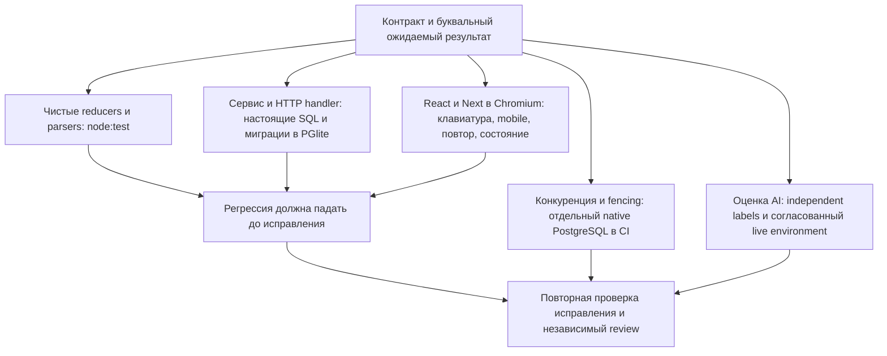

# Аудит кодовой базы и покрытия тестами — 09.10.2026

Аудит выполнен по запросу владельца для Chronicle Engine относительно `ba6451df90dba053e572a31b4cf51b4bff695f5d`. Изучена активная кодовая база, существующие проверки сопоставлены с реальными контрактами, воспроизведённые дефекты исправлены с регрессиями. Это локальная проверка кода; запуск на рабочей БД, платная генерация и развёртывание не выполнялись.

После подтверждённого владельцем [дополнительного этапа](test-followup-2026-10-09.md) текущий полный suite содержит **687/687 pass**; три native PostgreSQL fixtures исполнены отдельно **3/3 без skip**. Ниже сохранён исходный audit679 как история этапа; актуальные пофайловые counters и статусы находятся в JSON/матрице.

Основной результат — [матрица 25 направлений с конкретными следующими сценариями](testing/coverage-matrix-2026-10-09.md) и [пофайловая машинная карта](testing/coverage-inventory-2026-10-09.json). Карта разделяет прямой вызов production-кода, косвенную достижимость, браузерные сценарии с подменой API и ещё не выполненные проверки. Импорт модуля сам по себе не доказывает проверку его поведения.

## Область исследования

Проверены все 228 файлов `src`: 119 в `lib`, 39 в каталоге компонентов, 43 API handler и 27 остальных файлов приложения/БД/оболочки. Карта также перечисляет 108 обычных test-файлов, три opt-in native PostgreSQL integration, четыре helper, две fixture и 104 сопутствующих файла: scripts, миграции и ledger, deployment/CI, public metadata и конфигурацию. Реальные пути, потребители, названия тестов, оракулы и ограничения сохранены в JSON; перечень сверяется с файловой системой.

`node_modules`, generated `.next`, локальный `output`, секретные `.env*` и кандидатные `revisions` не входят в активный source denominator. Архивные отчёты исследований читаются как история доказательств, а не как результаты текущего исполнения. Для изолированной сборки и браузера имена переменных из `.env*` использованы только для очистки окружения; значения не использовались и не выводились.

Аудит разделён между независимыми сабагентами по состоянию/повествованию, памяти/identity/persistence, провайдерам/evaluations и UI/API. Для исполнителей и проверяющих использованы reasoning `high` и `xhigh`; финальный review выполняет отдельный агент. Применены relevant skills для параллельной работы, систематической диагностики, TDD, проектирования тестовых границ, review и проверки перед завершением.

## Схема проверок

PGlite сохраняет реальные schema, SQL, transaction и pgvector, но не заменяет несколько PostgreSQL connections/processes при проверке advisory locks, contention и lease races. Browser fixtures выполняют настоящий React/Next и проверяют отправленный payload и видимое состояние; подменённый API не доказывает корректность настоящего route handler. Synthetic verdict проверяет серверную реакцию и сохранение, но не семантическое качество живой модели.

## Исправленные дефекты и регрессии

| Граница | Исправление | Проверка поведения |
| --- | --- | --- |
| Окончательный ход и guard | Verifier получает план после life/agenda/social/timers/recovery. Каждый repaired draft строит свой чистый план из одного admitted snapshot; commit, история, память и jobs используют только финальный принятый результат | [narrative-turn-integration.test.ts](../tests/narrative-turn-integration.test.ts), [narrative-guard.test.ts](../tests/narrative-guard.test.ts): actual `performTurn`, migrated PGlite, буквальные state/turn/choices/memory/job expectations |
| Парсер и передачи | Null/primitive/array entries безопасно отбрасываются; неоднозначный предмет не списывается; UUID/prefix/#ID имеет приоритет над похожим именем; `touchedItemIds` не мутируется | [resolution.test.ts](../tests/resolution.test.ts), [world-life.test.ts](../tests/world-life.test.ts): malformed proposals, collision в двух порядках inventory, purity |
| Исторические notes | Проверка охватывает новые commitments/agenda/NPC notes и историю связей, сравнивает before/history и не принимает намерение за прошлое событие. Новый task version отделяет прежние replay recordings | [narrative-verifier.test.ts](../tests/narrative-verifier.test.ts), [jev-tasks.test.ts](../tests/jev-tasks.test.ts): actual outgoing body, synthetic verdict propagation и literal старый version |
| Память | Unicode matching отклоняет state-owned resource changes/числовой HP/XP balance, acquisition и movement; описания золота/монет, бытовой опыт и похожие слова сохраняются | [upgrade.test.ts](../tests/upgrade.test.ts): Russian/English negatives и положительные контроли; дополнительный review выявил и исправил потерянную защиту HP/XP balances |
| Перенос ключей | Production `applyLegacyProfileAssignment` стал общей границей CLI и теста; тестовая ручная SQL-имитация заменена реальным importer | [legacy-settings-import.test.ts](../tests/legacy-settings-import.test.ts): conflict, пять purposes, owner rebinding, global preservation, unreadable/ownership-race rollback; mutation control выявляет удалённый guard |
| Gemini transport | Общий deadline действует на fetch, JSON/SSE reader и callbacks; bounded wire/frame/text, cleanup при отказе/late headers, безопасные ошибки, explicit zero usage, одна terminal telemetry без дополнительного paid attempt | [gemini-transport.test.ts](../tests/gemini-transport.test.ts): настоящие Web streams с synthetic fetch, stalled/cancel/rotation/usage/telemetry controls |
| Иллюстрации | Unread/oversize/stalled body отменяется; arbitrary provider errors не сохраняются и не возвращаются из legacy gallery rows; disabled generation блокирует pending/retry до SQL/квоты/сети; cached ready сохраняется | [visual-provider.test.ts](../tests/visual-provider.test.ts), [visual-render.test.ts](../tests/visual-render.test.ts), [visual-gallery-browser.ts](../scripts/visual-gallery-browser.ts): реальная SQL, API projection, PNG decoding control, keyboard/mobile/disabled/public views |
| Нулевая квота | Settings POST/GET сохраняет explicit `0` для всех трёх limits; story draft возвращает `QUOTA_EXHAUSTED`/429 до provider fetch | [quota-ingress.test.ts](../tests/quota-ingress.test.ts): actual settings/creation/connection handler, реальные сохранённые значения и нулевой fetch counter |
| Evaluator | Текущий npm/tsx entrypoint исполним; без `--live` нет сети, требуется cookie, проверяется HTTP-call budget, ошибки не копируют cookie/provider text; выбранная внешняя модель допустима | [story-draft-eval-cli.test.ts](../tests/story-draft-eval-cli.test.ts): реальный subprocess/loopback, пять контрактных cases; deadline/redirect/model-mismatch остаются implementation-only до дополнительных cases |
| Jev corpus/adapter | «Обещание в прошлом» отделено от «встречи сейчас»; malformed ответы проходят actual adapter, а не только legacy parser | [typesafe-runtime-evidence.test.ts](../tests/typesafe-runtime-evidence.test.ts), [typesafe-scenarios.json](../tests/fixtures/typesafe-scenarios.json); авторские метки не объявлены independent gold |
| UI fixture и consumers | Неописанные запросы и mutations получают 501; save fixture проверяет отказ/повтор/payload/GET после reopen; turn fixture сверяет реальный snapshot и сохраняет DOM identity | [ui-mock.test.ts](../tests/ui-mock.test.ts), [story-experience-browser.ts](../scripts/story-experience-browser.ts), [turn-latency-browser.ts](../scripts/turn-latency-browser.ts) |
| Идентификатор поставки | Автоматический seed наследуется всеми config/build workers; production-server использует сохранённый `.next/BUILD_ID`. Переменные при restart не меняют идентификатор готовой сборки | [build-version.test.ts](../tests/build-version.test.ts): real Next loader/child processes и literal overrides; реальный default build/start/restart сверяет artifact, HTML, API, SW и client banner |

RED/GREEN и findings отдельных рабочих групп сохранены в локальном `output/test-audit/`. Итоговая оценка исправлений основана на текущих исходниках и проверках, а не на исторической записи первоначального дефекта.

## Качество существующих тестов

Сильные проверки выполняют настоящий service/handler, проверяют независимые буквальные результаты, отказ до побочных эффектов, rollback и отрицательные controls. Они сохранены. Для внешней сети подменяется transport boundary, для SQL — только pool adapter к disposable PGlite; бизнес-логика остаётся настоящей.

Выявлены и явно отмечены более слабые доказательства:

- SQL/source/prompt substring assertions полезны как structural guards, но не заменяют execution и правильность решения.
- Expected values, вычисленные из самого result, проверяют согласованность, но могут повторять ошибку реализации; нужны независимые counter tables на порогах ресурсов.
- Genre/profile/mode preservation loops полезны как smoke, но не доказывают реальные различия `preset/free` в `performTurn`.
- `experience-v25.test.ts` проверяет legacy `world-map.ts`; текущий UI использует `world-graph.ts`. `jev-mechanics.ts` и standalone `parseTypeSafeResponse` также не доказывают current runtime adapter behavior.
- Старые необязательные browser-smoke сценарии содержат устаревшие selectors; они не используются как доказательство текущего интерфейса. Актуальные consumers исправлены и исполняются отдельно.
- TypeSafe/evaluation development corpus имеет авторские метки. Structural PASS, replay или наличие `heldout` в имени не делает его независимой оценкой модели.

## Фактическая проверка

Среда: Windows, Node.js 24.13.0, npm 11.19.0, Next.js 16.3.8; версия закреплена в manifest/lockfile диапазоном `~16.3.8`. Исходный tracked checkout был чистым; работа выполнялась в отдельном managed worktree.

Итог перенесён в `E:\Projects\RPG_arena`: 52 изменённых/новых code/doc файлов сверены по SHA256 с проверенным worktree. В основном каталоге заново выполнены `npm ci --ignore-scripts`, typecheck, lint, документационный checker и изолированная production build. Дополнительный actual start проверил artifact/API/HTML/SW identity, запрет кэша/guest cookie у версии и сохранение ID при startup overrides. Все финальные проверки прошли. Generated logs, SHA manifest и результаты находятся в `output/test-audit/`; полный test/LCOV run относится к побайтно идентичному source/test snapshot worktree. При следующем этапе восстановление прежнего зарегистрированного native archive вернуло `snapshot missing`; поэтому он не считается единственной recoverable копией. Все исходники и evidence сохранены в основном каталоге, а follow-up использует новую изолированную копию с проверкой SHA256.

| Проверка | Результат |
| --- | --- |
| Исходный `npm test` | 596 pass, 0 fail, 0 skip |
| Общий промежуточный `npm run test:coverage` на 16.3.8 | 674 pass, 0 fail, 0 skip; затем внесено дополнительное исправление memory balance |
| Memory balance после review | RED: три нужных отказа отсутствовали, lore control прошёл; GREEN: 84/84 affected cases |
| Итоговый `npm run test:coverage` | **679 pass, 0 fail, 0 cancelled, 0 skip; 172540.8706 ms**, exit 0; на 83 runtime registrations больше исходного suite |
| `typecheck`, `lint`, `check:docs` | Exit 0; checker: 66 docs / 237 local links |
| Production build и actual identity parity | Exit 0; автоматический ID совпадает в artifact/HTML/API/SW/client, повторный start с конфликтующими overrides сохраняет его; browser errors=[] |
| Standalone VisualGallery | 10 Chromium checks, реальные PNG bytes, keyboard/mobile/public/disabled, errors=[] |
| Standalone AppUpdate guards | Exit 0; synthetic React fixture |
| Current story/turn consumers | Оба exit 0. Story: actual save failure→retry→reopen и безопасный повтор pending request; turn: preview→commit→snapshot DOM continuity. Baseline RED обоих — exit 1 по ожидаемым assertions |
| `npm audit --omit=dev` | 0 замечаний; dev toolchain проверяется отдельно |
| Полный `npm audit` | 9 dev-toolchain замечаний: 4 moderate, 5 high; 0 critical. Runtime subset чистый |
| Native PostgreSQL auth/quota/portable | Локально native runtime недоступен; три isolated CI steps настроены, запуск CI не заявляется |

`npm run test:coverage` исполняет обычный serial suite с safe bootstrap и пишет `output/test-coverage.lcov`. Node/V8 инструментирует код после `tsx`: helper functions и строки преобразования входят в counters. Поэтому raw line/branch/function numbers относятся **только к загруженному преобразованному подмножеству**, а не к точному original TypeScript покрытию или проценту всего приложения. Не загруженные файлы отмечаются отдельно. Runtime counters и соответствующий статус находятся в JSON-карте.

Production build и браузерный сервер используют unusable loopback `DATABASE_URL`, отключённые auto-migrate/telemetry/visual generation и очищенные credentials. Cookies удаляются на отдельном локальном proxy boundary; настоящее guest/account пространство не затрагивается. Стандартные `npm test`/`test:coverage` используют [test-environment.ts](../tests/helpers/test-environment.ts). Native tests в CI адресуют отдельный disposable service с fixture-only паролем.

Dependency patch обновляет Next/eslint-config-next 16.3.5 → 16.3.8, sharp 0.35.4 → 0.35.5 и source-map-js 1.2.1 → 1.2.2. Исходный audit имел 12 замечаний, включая один critical; audit этапа ниже — 9. В последующем этапе неиспользуемый Drizzle Kit удалён вместе со старой esbuild chain, а direct browser bundler явно объявлен как esbuild 0.28.2. Текущий runtime audit — ноль; текущий dev audit — **5 high**, одна цепочка eslint-config-next/fast-glob/micromatch/braces. Предложенный npm `fixAvailable` требует несовместимого downgrade основных tools; он не применён. Это известный dev dependency backlog, а не результат успешной проверки безопасности всех зависимостей.

Независимый review всего diff и последней build-identity delta завершился с `approval with limits`; после исправления ID/name collision, disabled retry и HP/XP regression открытых подтверждённых P0/P1/P2 нет. Final coverage, build и browsers оцениваются по завершённым logs/results. Проверяющий отдельно подтвердил membership всех source/test путей, корректность literal оракулов и раздельные пределы unit/SQL/browser/evaluation evidence.

Consumer evidence хранится раздельно: после первого combined run latency уже прошёл, а story ещё встретил устаревший путь ввода при pending request. Исправлен только story consumer и повторно выполнен только он. `ui-fixtures-green-result.json` сохраняет эту историю; актуальный story success — `ui-fixtures-green-story-result.json`, latency success — предыдущая запись code 0 и его PASS log. Эти два результата одной сборки не объявляются новым совместным запуском. Actual build parity — `build-version-parity-result.json`; review — `final-independent-review.md` в локальном `output/test-audit/`.

## Необходимое следующее покрытие

Точные названия предлагаемых scenarios и существующая подходящая граница перечислены в [25 строках матрицы](testing/coverage-matrix-2026-10-09.md). Наиболее существенный следующий этап:

1. Independent native PostgreSQL contenders для turn admission/idempotency/fencing/atomic rollback, quota, account claim и background fairness.
2. Полная owner/public/foreign/admin matrix на actual handlers и delayed identity revocation; public reading не даёт editing/export/generation authority.
3. Реальный lifecycle import/copy/checkpoint при lost response, повторе requestId и rollback, memory worker/compaction CAS и freshness retrieval.
4. Actual image GET lifecycle с cookie jar, cached/public/owner reads, concurrency и deletion during render; отдельное решение по ingress policy для generation через GET.
5. Две production-сборки и несколько вкладок для installed service worker/update/offline/pending draft, current map thresholds и telemetry lifecycle.
6. Независимая human-разметка minimal pairs и heldout evaluation полного сериализованного контекста. Платный live запуск требует согласованного окружения.

Покрытие расширяется по этим контрактам; бессодержательные mirror tests, проценты по CSS/конфигурации и повторные проверки недостижимых legacy helpers не считаются повышением уверенности.

Полный журнал выполнения — [план аудита](superpowers/plans/2026-10-09-test-coverage-audit.md). Статусы развития и существующие task IDs сохраняются в [roadmap](superpowers/plans/roadmap.md).
